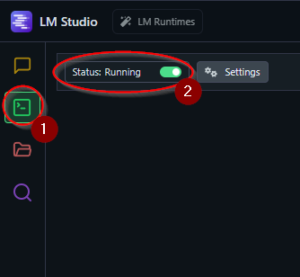

# Research Agent
An agent that has access to Wikipedia and the crawling of defined links. This tool allows you to search Wikipedia, fetch page content, and crawl websites to gather information for research purposes.

## Features

- Search Wikipedia for relevant pages
- Fetch detailed content from Wikipedia pages
- Crawl websites and extract content in markdown format
- Interactive conversation with an AI model

## Requirements

- Python 3.13 or other versions compatible with LM-Studio and Crawl4AI
- LM-Studio
- Crawl4AI

## Install

### All Platforms

1. Install LM-Studio from [https://lmstudio.ai/](https://lmstudio.ai/)

2. Install project dependencies:

```bash
pip install -r requirements.txt
```

3. Install Crawl4AI from [https://docs.crawl4ai.com/core/installation/](https://docs.crawl4ai.com/core/installation/)

```bash
crawl4ai-setup
```

```bash
pip install crawl4ai[all]
```

```bash
crawl4ai-setup
```

```bash
crawl4ai-doctor
```

```bash
pip install -r requirements.txt
```

## Usage

1. Start LM-Studio and enable the Server in the UI or in the Console

   

   ```bash
   lms server start
   ```

2. Models will be loaded at runtime through the program, make sure you have a model downloaded. I recommend qwen3-8b.

3. Run the main script:

   ```bash
   python main.py
   ```

4. Interact with the agent by typing your research questions or commands.

## How it works

The agent uses:

- LM Studio API to communicate with AI models
- Wikipedia API to search and retrieve information
- Crawl4AI to extract content from web pages

## License

This project is licensed under the MIT License - see the [LICENSE](LICENSE) file for details.

## Todo

- Implement a memory and goal feature as a toolcall for the model so that context window is no longer an issue

- Implement a search tool for the model to search outside of Wikipedia

## OpenAI Compatibility

This project now includes compatibility with OpenAI models. You can use OpenAI as a provider for interacting with AI models.

### Using OpenAI as a Provider

1. Install the OpenAI Python package:

```bash
pip install openai
```

2. Set your OpenAI API key as an environment variable:

```bash
export OPENAI_API_KEY='your-api-key'
```

3. Update the `main.py` script to use OpenAI models by importing the necessary functions from `openai_provider.py`.

4. Run the main script:

```bash
python main.py
```

5. Interact with the agent by typing your research questions or commands.
